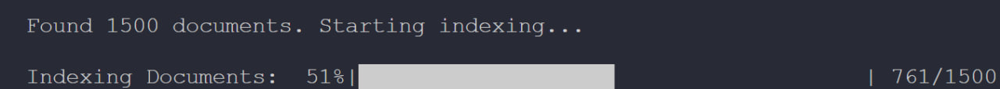
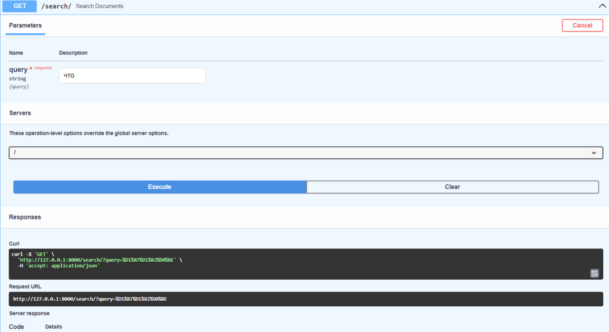
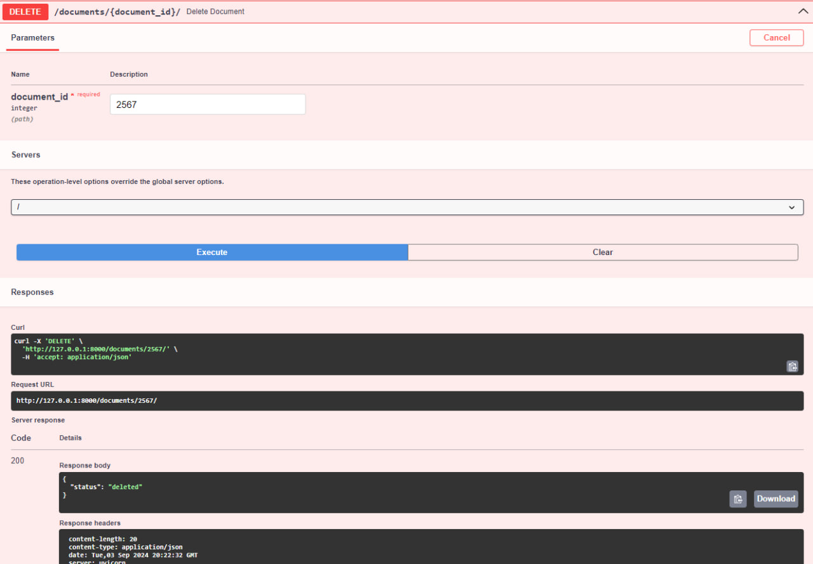

# Сервис для поиска документов

Этот проект позволяет индексировать документы из CSV файла в Elasticsearch и предоставляет API для поиска и управления этими документами через FastAPI.

## Инструкции по установке

### Шаг 1: Клонирование репозитория

```bash
git clone git@github.com:Cair06/search-documents.git
cd search-documents
```

### Шаг 2: Сборка и запуск Docker контейнеров

```bash
docker compose up -d --build
```

### Шаг 3: Применение миграций базы данных и загрузка данных

Запустите следующие команды для применения миграций базы данных, очистки существующих данных и загрузки документов из CSV файла:

```bash
docker exec -it fastapi_app bash -c "alembic upgrade head"
docker exec -it postgres_db psql -U postgres -d search_service -c "DELETE FROM documents;"
docker exec -it fastapi_app bash -c "python app/csv_converter.py"
```

### Шаг 4: Индексация документов в Elasticsearch

После выполнения вышеуказанных команд необходимо проиндексировать документы в Elasticsearch. Запустите следующую команду:

```bash
docker exec -it fastapi_app bash -c "python -m app.ind_elastic"
```



**Примечание:** Если вы столкнетесь с ошибкой, связанной с подключением к Elasticsearch (например, \`ConnectionError\`), подождите несколько минут и повторите команду ещё раз, пока процесс индексации не начнется.

### Шаг 5:

Запуск и проверка тестов
```bash
docker exec -it fastapi_app bash -c "pytest -p no:warnings"
```

### Шаг 6: Доступ к документации API

После запуска контейнеров и индексации документов вы можете получить доступ к документации API через Swagger по следующему адресу:

`http://127.0.0.1:8000/docs`

В Swagger UI вы можете протестировать API эндпоинты напрямую:

-   Поиск документов: Используйте эндпоинт /search/, чтобы искать документы по строке запроса.

    

-   Удаление документа: Используйте эндпоинт /documents/{document_id}/, чтобы удалить документ по его ID.

    

### Устранение неполадок

Если вы получаете ошибку 500 при поиске или удалении документов, подождите несколько минут и попробуйте снова.
Elasticsearch может занять некоторое время для полной инициализации, особенно при первом запуске.
